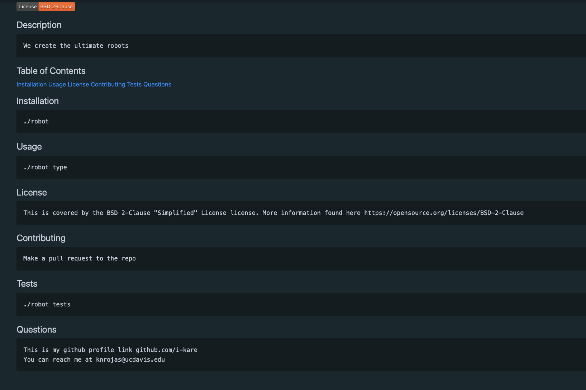

# Professional-README-Generator
5.14.23 A command-line application that dynamically generates a professional README.md file from a user's input. This will allow project creators to devote more time working on the project.

## Acceptance Criteria

1. WHEN I am prompted for information about my application repository THEN a high-quality, professional README.md is generated with the title of my project and sections entitled Description, Table of Contents, Installation, Usage, License, Contributing, Tests, and Questions

2. WHEN I enter my project title THEN this is displayed as the title of the README

3. WHEN I enter a description, installation instructions, usage information, contribution guidelines, and test instructions THEN this information is added to the sections of the README entitled Description, Installation, Usage, Contributing, and Tests

4. WHEN I choose a license for my application from a list of options THEN a badge for that license is added near the top of the README and a notice is added to the section of the README entitled License that explains which license the application is covered under

5. WHEN I enter my GitHub username THEN this is added to the section of the README entitled Questions, with a link to my GitHub profile

6. WHEN I enter my email address THEN this is added to the section of the README entitled Questions, with instructions on how to reach me with additional questions

7. WHEN I click on the links in the Table of Contents THEN I am taken to the corresponding section of the README

## Walkthrough Video 
Video: https://drive.google.com/file/d/1oJ6zkLvsifHjQVYKrtOH2NOj52NGb1ez/view?usp=sharingLinks

## Screenshot of App
The following is a screenshot for the mechanical devices sample markdown.

## Sample README.md
1. [Mechanical Devices.md](./Mechanical%20Devices.md)

